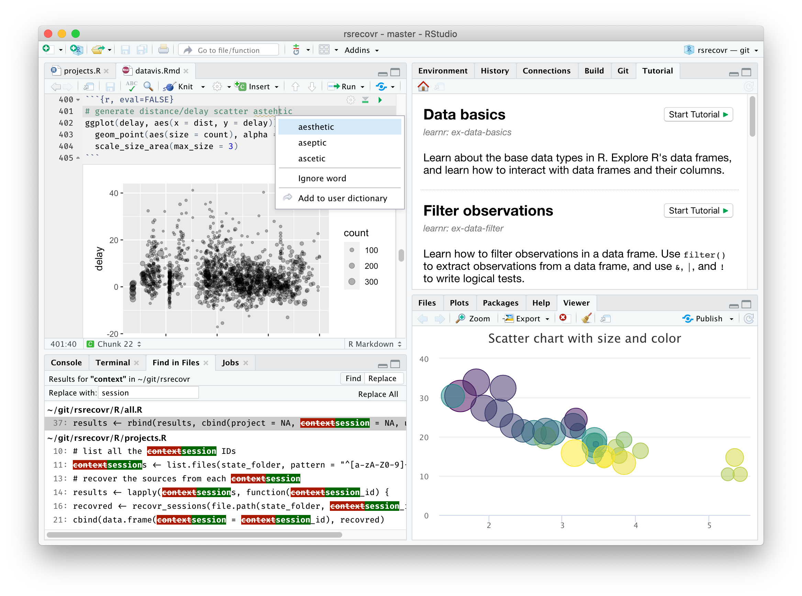

class: inverse, center, bottom
background-image: url(images/LEAP_logo.png)

## Follow along with the slides - URL in Chat

```{r setup, include=FALSE}
options(htmltools.dir.version = FALSE)

knitr::opts_chunk$set(message = F, warning = F)

library(pacman)
p_load(tidyverse, xaringan, xaringanExtra, scales, ggrepel, ggtext)

# ggplot2 settings so plots scale well for slide size 
theme_set(theme_light(16)) # 16 for full width, 18 for half width 
update_geom_defaults("point", list(size = 2.0)) # 2 for full width, 2.5 for half width

```
---
# Purpose

.pull-left[

### 1. Get you excited about data viz.
### 2. Show some tips and tricks that make your figures pop
irrespective of software used
### 3. Evangelize R

]

.pull-right[


.footnote[
Photo from [Hans Rosling's TED Talk](https://www.ted.com/talks/hans_rosling_the_best_stats_you_ve_ever_seen) 
]
]
---
class: center, top

# Everything is a story

### /ˈstɔːri/


---
class: center, top


###[Dan Harmon's Story circle](https://youtu.be/UdxX_Kljrq8)

---
class: center, top
## Our Own Story Circle

### Figure here

---

# The zone of comfort

Our stomping ground **MS Excel**:


---

# The zone of comfort

**MS Excel** has useful features that suggest how to visualize your data


---
# Why leave?

.center[


]

---
class: center, top


###[Dan Harmon's Story circle](https://youtu.be/UdxX_Kljrq8)


---
# You want to learn about your data by

```{r, echo = F}
xaringanExtra::use_panelset()
style_panelset_tabs(foreground = "honeydew", background = "seagreen")

```

.panelset[
.panel[.panel-name[Counting things]

```{r}
df <- read_rds("data/baptism_data.rds")

df %>% 
  count(female_profession, sort = T)
```


]

.panel[.panel-name[Drawing maps]

```{r, echo=F, warning=F, message=F, fig.width = 8, fig.asp = 0.618, dev = "svg", fig.align='center'}
p <- read_rds("data/map_of_churches.rds")
p
```

]

.panel[.panel-name[Making plots]

```{r, echo = F, warning=F, message=F, fig.width = 8, fig.asp = 0.618, dev = "svg"}
df %>% 
  group_by(parish_name) %>% 
  summarise(n_obs = n()) %>% 
  mutate(parish_name = fct_reorder(parish_name, n_obs)) %>% 
  ggplot(aes(x = n_obs, y = parish_name, fill = parish_name)) +
  geom_col(show.legend = FALSE) +
  geom_text(aes(x = n_obs, y = parish_name, label = n_obs), hjust = -.2) +
  scale_fill_brewer(palette = "Dark2") +
  expand_limits(x = 850) +
  labs(x = "Number of baptisms",
       y = NULL) +
  theme(panel.grid = element_blank(),
        panel.border = element_blank())
```


]
]


---
# You want to make beautiful charts with

.panelset[
.panel[.panel-name[Informative colours]

```{r, echo=F, warning=F, message=F}
s <- read_rds("data/map_of_africa_colour.rds")
s
```


]

.panel[.panel-name[Interactive elements]

```{r, echo=F, fig.align='center'}
int_fig <- read_rds("data/interactive_fig.rds")
int_fig
```


]

.panel[.panel-name[Engaging animations]

<center>

<iframe width="540" height="540" src="https://www.youtube.com/embed/D_Aakjiadm4" title="YouTube video player" frameborder="0" allow="accelerometer; autoplay; clipboard-write; encrypted-media; gyroscope; picture-in-picture" allowfullscreen></iframe>

</center>

]
]


---
# Tips and Tricks

### Back to the suggested Excel Chart


---
# Advantages of R

### Workflow

With other software, your workflow is separated between different applications and windows:

.pull-left[


]

.pull-right[


]

---

# Advantages of R

## Rstudio lets you do all your work in one place

```{r, echo=FALSE, out.width="80%", fig.align = 'center'}

```

---
# Advantages of R

## Export your R work to any number of formats

```{r, echo=FALSE, out.width="90%", fig.align = 'center'}
knitr::include_graphics("images/rmarkdown.png")
```


---

# Advantages of R

## Programatic updating


---
# Advantages of R

### If you're an economist:
--

- You're likely to want do do a DiD at some point.

- You may be interested in ML or Big Data


---
# Advantages of R: Economist
### The latest DiD methods are implemented in R

For example: 
- [Difference-in-Differences with multiple time periods](https://www.sciencedirect.com/science/article/abs/pii/S0304407620303948?via%3Dihub)
- [How Much Should We Trust Staggered Difference-In-Differences Estimates?](https://andrewcbaker.netlify.app/publication/blw_did/)


---
### Colour


---
# Making maps

Contextual maps.

Chloropleths.

Animated maps.

---
# Coffee rating map

.panelset[
.panel[.panel-name[Plot]

```{r, coffee-map-demo-0-out, ref.label="coffee-map-demo-0", echo=FALSE, warning=FALSE, fig.width = 8, fig.asp = 0.618, dev = "svg"}

```

]

.panel[.panel-name[Code]

```{r coffee-map-demo-0, warning=F, eval=F}
df <- read_rds("data/coffee_data.rds")

ggplot(data = df) +
  borders() +
  geom_sf(aes(fill = mean_country_rating, geometry = geometry)) +
  scale_fill_viridis_c(trans = "sqrt") +
  theme_void() +
  theme(legend.position = "bottom") +
  coord_sf(ylim = c(-50, 80)) +
  facet_wrap(~ species, nrow = 2) +
  labs(title = "Average Coffee Rating",
       subtitle = "By country and species",
       fill = "Average Rating / 100",
       caption = "Data: James LeDoux - https://github.com/jldbc/coffee-quality-database",
       x = "",
       y = "")

```

]
]

---
# What are the problems with this map?

--

- Lots of missing data

--

- Only some countries produce coffee, very few produce Robusta beans

--

- **Crucially, we cannot see the countries with small land area**

---
# What shall we do about this?

.panelset[
.panel[.panel-name[Plot]

```{r, coffee-map-demo-1-out, ref.label="coffee-map-demo-1", echo=FALSE, warning=FALSE, fig.width = 8, fig.asp = 0.618, dev = "svg"}

```

]

.panel[.panel-name[Code]

```{r coffee-map-demo-1, warning=F, eval=F}
library(tidytext)

df %>% 
  select(-geometry) %>% 
  mutate(country_name = countrycode::countrycode(iso_a3, "iso3c", "country.name")) %>%
  mutate(country_name = reorder_within(country_name, mean_country_rating, species)) %>% 
  group_by(species) %>% 
  slice_max(mean_country_rating, n = 10) %>% 
  ungroup() %>% 
  ggplot(aes(x = mean_country_rating, y = country_name, fill = region_un)) +
  geom_col() +
  facet_wrap(~ species, scales = "free") +
  scale_y_reordered() +
  coord_cartesian(xlim = c(70, 90)) +
  labs(x = "Mean coffee rating",
       y = NULL,
       fill = "Region")

```

]
]

---
# The trusty column chart gets us some of the way there

--

- We still have some information about the geography of the countries that produce the best coffee

--

- The chart is very legible and the comparisons are clear

--

- But, we have lost the effect of latitude that we saw in Africa.

---
# We may care about spatial autocorrelation

We see in a zoomed in section that as we move North and towards the ethiopian highlands, the coffee rating improves.

```{r, echo=F, warning=F}
library(rnaturalearth)
library(ggiraph)

q <- ggplot(data = df %>% filter(species == "Arabica", region_un == "Africa")) +
  borders() +
  geom_sf(aes(fill = mean_country_rating, geometry = geometry)) +
  scale_fill_viridis_c(trans = "sqrt") +
  theme_void() +
  theme(legend.position = "right") +
  coord_sf(ylim = c(-25, 20),
           xlim = c(-20,50)) +
  labs(title = "Average Arabica coffee rating by country",
       fill = "Average Rating / 100",
       caption = "Data: James LeDoux - https://github.com/jldbc/coffee-quality-database",
       x = "",
       y = "")

r <- girafe(
  ggobj = q,
  width_svg = 8,
  height_svg = 6,
  )

r

```

---

class: inverse, center, middle

# How can we show this on a map?

--

## Represent each country with the same size

### And arrange the countries in 'roughly' the correct place geographically

---
.panelset[
.panel[.panel-name[Plot]

```{r coffee-map-demo-2-out, ref.label="coffee-map-demo-2", echo=FALSE, warning=FALSE, fig.width = 9, fig.asp = 0.618, dev = "svg"}

```

]

.panel[.panel-name[Code]

```{r coffee-map-demo-2, eval = F, warning=F}
df <- read_rds("data/coffee_map_tiles.rds")

df %>% 
  ggplot(aes(xmin = x, ymin = y, xmax = x + 1, ymax = y + 1)) +
  geom_rect(color = "#ffffff") +
  geom_rect(color = "#ffffff", aes(fill = mean_country_rating)) +
  scale_fill_viridis_c(trans = "sqrt") +
  geom_text(aes(x = x, y = y, label = alpha.2), color = "#ffffff", 
              alpha = 0.5, nudge_x = 0.5, nudge_y = 0.5, size = 2.8) +
  theme(panel.grid = element_blank()) +
  theme_void() +
  theme(legend.position = "bottom") +
  coord_equal() +
  labs(fill = "Average Arabica coffee rating by country")

```

]
]

---

# What have we improved?

.pull-left[

```{r coffee-map-demo-2-out-small, ref.label="coffee-map-demo-2", echo=FALSE, warning=FALSE, fig.width = 8, fig.asp = 1.1, dev = "svg"}

```

]

.pull-right[

- We can see the spatial correlation in Africa

- Geographically small countries are not forgotten

- Comparing countries is not difficult with the diverging colour scale

]

---
# Time on a third axis

Sometimes it is interesting to show an evolution of two variables over time. 

For example, say we have information on fertility rates and the share of children born outside of marriage in Europe.

The data looks like this:
```{r, echo=T}
df <- read.csv("data/df_denmark_greece.csv") %>% as_tibble()

df %>% head()
```

---

## The obvious choice is a line chart

.panelset[
.panel[.panel-name[Plot]

```{r, greece-denmark-demo-0-out, ref.label="greece-denmark-demo-0", echo=FALSE, warning=FALSE, fig.width = 8, fig.asp = 0.618, dev = "svg"}

```


]

.panel[.panel-name[Code]

```{r greece-denmark-demo-0, warning=F, eval=F}
df %>% 
  # gives meaningful variable names
  rename(`Total fertility rate` = tfr,
         `Proportion of births outside marriage` = pbom) %>% 
  # makes it into a longer dataset so that we can facet 
  # wrap by indicator
  pivot_longer(-c(country, year), names_to = "indicator") %>% 
  ggplot(aes(year, value, colour = country)) +
  # here we say nrow = 2 so that they are above one another
  facet_wrap(~ indicator, nrow = 2, scales = "free_y") +
  geom_line() +
  # remove unnecessary axis labels
  labs(y = NULL,
       x = "Year",
       colour = "Country") +
  theme(legend.position = "right")

```

]
]

---
### An alternative
.panelset[
.panel[.panel-name[Plot]
```{r greece-denmark-demo-1-out, ref.label="greece-denmark-demo-1", echo=FALSE, warning=FALSE, fig.width = 8, fig.asp = 0.618, dev = "svg"}

```


]

.panel[.panel-name[Code]


```{r greece-denmark-demo-1, eval = F}

df %>% 
  mutate(year_flag = ifelse(test = year %% 7 == 0, 
                            yes = year, 
                            no = NA)) %>% 
  ggplot(aes(tfr, pbom, colour = country, label = year_flag)) +
  geom_point() +
  geom_segment(aes(x= tfr, 
                   y= pbom,
                   xend=c(tail(tfr, n=-1), NA), 
                   yend=c(tail(pbom, n=-1), NA)),
               arrow = arrow(length=unit(0.25,"cm"))) +
  geom_text_repel(colour = "black") +
  scale_y_continuous(labels = percent_format(scale = 1)) +
  scale_colour_manual(values = c("#C60C30", "#0D5EAF")) +
  labs(x = "Total fertility rate",
       y = "Proportion of births\noutside of marriage",
       title = "Fertility vs births outside of marriage 
       in <span style='color:#C60C30'>Denmark</span> and 
       <span style='color:#0D5EAF'>Greece</span>") +
  theme(legend.position = "none",
        plot.title = element_markdown(size = 18))

```


]
]

---

## What have we learned?

.pull-left[

```{r greece-denmark-demo-1-out-small, ref.label="greece-denmark-demo-1", echo=FALSE, warning=FALSE, fig.width = 8, fig.asp = 1.3, dev = "svg"}

```

]

.pull-right[

- Both countries saw a large drop in fertility from the 1960s until the 1980s

- In Denmark, after 1970 we see an increase in the share of children born outside of marriage

- In contrast, Greek families have relatively few children outside of marriage.

- After 1990, Danish fertility increased from 1.3 to 1.8, while Greek fertility remained at 'lowest-low' levels, below replacement.
]

---

## What have we changed?

.pull-left[

```{r greece-denmark-demo-1-out-comparison, ref.label="greece-denmark-demo-1", echo=FALSE, warning=FALSE, fig.width = 8, fig.asp = 1.3, dev = "svg"}

```

]

.pull-right[

- Indicators on the x- and y-axis and then show time with text labels

- Legend is replaced with colour coded title

- Colours have meaning (main colour of country flag)

- Percentage labels on the y-axis

]

---
# Giving context with colour

## Sometimes we may want to show a particular series of data in its correct context. 

### For instance, in our line graph above which showed the evoltuion of the share of births outside of marriage in **Denmark and Greece**, we might want to know if these two represent the **extremes** within Europe.

---
## Do **Denmark and Greece** represent the **extremes** of the share of children born outside of marriage in Europe?

.panelset[
.panel[.panel-name[Plot]

```{r greece-denmark-marriage-demo-0-out, ref.label="greece-denmark-marriage-demo-0", echo=FALSE, warning=FALSE, fig.width = 7, fig.asp = 0.618, dev = "svg"}

```

]

.panel[.panel-name[Code]


```{r greece-denmark-marriage-demo-0, eval = F}
df <- read_rds("data/births_outside_marriage.rds")
  
df %>%   
  filter(flag == 1) %>% 
  ggplot(aes(x = year, y = pbom, group = country, colour = country)) +
  geom_line() +
  scale_y_continuous(labels = percent_format(scale = 1)) +
  labs(y = "Proportion of births\noutside of marriage",
       x = NULL,
       colour = "Country")
```


]
]

---
### One way to do this would be to show an average and then how these compare

.panelset[
.panel[.panel-name[Plot]

```{r greece-denmark-marriage-demo-1-out, ref.label="greece-denmark-marriage-demo-1", echo=FALSE, warning=FALSE, fig.width = 7, fig.asp = 0.618, dev = "svg"}

```

]

.panel[.panel-name[Code]


```{r greece-denmark-marriage-demo-1, eval = F}
df %>% 
  group_by(year) %>% 
  mutate(mean_pbom = mean(pbom, na.rm = T)) %>% 
  ungroup() %>% 
  ggplot() +
  geom_line(aes(x = year, y = pbom, group = country, colour = country), 
            data = df %>% filter(flag == 1)) +
  geom_line(aes(x = year, y = mean_pbom, colour = "European average")) +
  scale_y_continuous(labels = percent_format(scale = 1)) +
  labs(y = "Proportion of births\noutside of marriage",
       x = NULL,
       colour = "Country")
```


]
]

---
### We can improve upon this by introducing an interval ribbon

.panelset[
.panel[.panel-name[Plot]

```{r greece-denmark-marriage-demo-2-out, ref.label="greece-denmark-marriage-demo-2", echo=FALSE, warning=FALSE, fig.width = 7, fig.asp = 0.618, dev = "svg"}

```

]

.panel[.panel-name[Code]


```{r greece-denmark-marriage-demo-2, eval = F}
df %>% 
  group_by(year) %>% 
  mutate(mean_pbom = mean(pbom, na.rm = T),
         pct_10 = quantile(pbom, .1, na.rm = T), #<<
         pct_90 = quantile(pbom, .9, na.rm = T)) %>% #<< 
  ungroup() %>% 
  ggplot() +
  geom_line(aes(x = year, y = pbom, group = country, colour = country), 
            data = df %>% filter(flag == 1)) +
  geom_ribbon(aes(x = year, ymin = pct_10, ymax = pct_90, #<<
                  fill = "Interval \n(10th to 90th percentile)"), alpha = .3) + #<<
  geom_line(aes(x = year, y = mean_pbom, colour = "European average")) +
  scale_y_continuous(labels = percent_format(scale = 1)) +
  scale_fill_manual(values = "#90ee90") + #<<
  guides(fill = guide_legend(order = 2), #<<
         col = guide_legend(order = 1)) + #<<
  labs(y = "Proportion of births\noutside of marriage",
       x = NULL,
       colour = "Country",
       fill = "") #<<
```


]
]

---
### An alternative improvement shows the series for each country
.panelset[
.panel[.panel-name[Plot]

```{r greece-denmark-marriage-demo-3-out, ref.label="greece-denmark-marriage-demo-3", echo=FALSE, warning=FALSE, fig.width = 7, fig.asp = 0.618, dev = "svg"}

```

]

.panel[.panel-name[Code]


```{r greece-denmark-marriage-demo-3, eval = F}
df %>%   
  ggplot(aes(x = year, y = pbom, group = country, colour = country)) +
  geom_line() +
  scale_y_continuous(labels = percent_format(scale = 1)) +
  labs(y = "Proportion of births\noutside of marriage",
       x = NULL,
       colour = "Country") +
  theme(legend.text = element_text(size = 4),
        axis.title = element_text(size = 8),
        legend.position = "bottom")
```


]
]


---

class: center, middle, inverse

# This is silly

--

## The legend is gigantic

## There are far too many colours

## We cannot see Denmark or Greece

---
### We can **highlight** the counties we are interested in
And gray out the other lines
.panelset[
.panel[.panel-name[Plot]

```{r greece-denmark-marriage-demo-4-out, ref.label="greece-denmark-marriage-demo-4", echo=FALSE, warning=FALSE, message=F, fig.width = 7, fig.asp = 0.618, dev = "svg"}

```

]

.panel[.panel-name[Code]


```{r greece-denmark-marriage-demo-4, eval = F}
library(gghighlight)

df %>%   
  ggplot() +
  geom_line(aes(x = year, y = pbom, colour = country)) +
  gghighlight(flag == 1) +
  scale_y_continuous(labels = percent_format(scale = 1)) +
  theme(legend.text = element_text(size = 4),
        legend.position = "bottom",
        plot.title = element_markdown(size = 14)) +
  scale_colour_manual(values = c("#C60C30", "#0D5EAF")) +
  labs(title = "Proportion of births outside of marriage in <span style='color:#C60C30'>Denmark</span> and <span style='color:#0D5EAF'>Greece</span>",
       y = "Proportion of births\noutside of marriage",
       x = NULL,
       colour = "Country")
```

]
]
---
# Advantages of gghighlight

.pull-left[
```{r greece-denmark-marriage-demo-4-out-small, ref.label="greece-denmark-marriage-demo-4", echo=FALSE, warning=FALSE, message=F, fig.width = 7, fig.asp = 1.3, dev = "svg"}

```


]

.pull-right[

- Shows each of the series

- Makes clear which countries you are interested in

- Does not hide outliers

- A good complement to a ribbon showing the 10th to 90th perceintile interval

]

---
# Interactivity

Publishing your research on the web is a good way to get it out there. Making your visualizations interactive is a fantastic way to have your readers explore the story you tell.

---
# Economic history data example

We're going to go from importing the data to making one polished plot.

---

# Importing data into R

## Skimr::skim()

```{r}
# df <- read_rds("data/")
```

