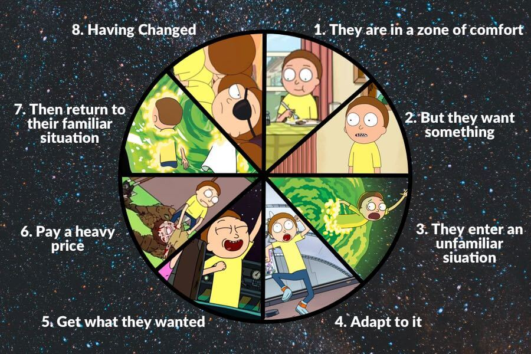

class: inverse, center, bottom
background-image: url(images/LEAP_logo.png)

## Follow along with the slides - URL in Chat

```{r setup, include=FALSE}
options(htmltools.dir.version = FALSE)

knitr::opts_chunk$set(message = F, warning = F)

library(pacman)
p_load(tidyverse, xaringan, xaringanExtra, scales, ggrepel, ggtext, ggiraph, htmlwidgets, glue)

# ggplot2 settings so plots scale well for slide size 
theme_set(theme_light(16)) # 16 for full width, 18 for half width 
update_geom_defaults("point", list(size = 2.0)) # 2 for full width, 2.5 for half width

```
---
# Purpose

.pull-left[

### 1. Get you excited about data viz.
### 2. Show some tips and tricks that make your figures pop
irrespective of software used
### 3. Evangelize R

]

.pull-right[


.footnote[
Photo from [Hans Rosling's TED Talk](https://www.ted.com/talks/hans_rosling_the_best_stats_you_ve_ever_seen) 
]
]
---
# Structure


.pull-left[

### 1. Exploratory Data Analysis

### 2. Why Data Viz?

#### Break

### 3. Polishing Figures for Publication

### 4. Interactivity

### 5. Recreating Published Figures

]

.pull-right[


]

---

class: center, top

# Everything is a story

### /ˈstɔːri/


---
class: center, top



###[Dan Harmon's Story circle](https://youtu.be/UdxX_Kljrq8)

---
class: center, top
## Our Own Story Circle

### Figure here

---

# 1. The zone of comfort

Our stomping ground **MS Excel**:


---

# 1. The zone of comfort

**MS Excel** has useful features that suggest how to visualize your data


---
# Why leave?

.center[


]

---
class: inverse, center, middle

# 2. You want something

---
# You want to learn about your data by

```{r, echo = F}
xaringanExtra::use_panelset()
style_panelset_tabs(foreground = "honeydew", background = "seagreen")

```

.panelset[
.panel[.panel-name[Counting things]

```{r}
df <- read_rds("data/baptism_data.rds")

df %>% 
  count(female_profession, sort = T)
```


]

.panel[.panel-name[Drawing maps]

```{r, echo=F, warning=F, message=F, fig.width = 8, fig.asp = 0.618, dev = "svg", fig.align='center'}
p <- read_rds("data/map_of_churches.rds")
p
```

]

.panel[.panel-name[Making plots]

```{r, echo = F, warning=F, message=F, fig.width = 8, fig.asp = 0.618, dev = "svg"}
df %>% 
  group_by(parish_name) %>% 
  summarise(n_obs = n()) %>% 
  mutate(parish_name = fct_reorder(parish_name, n_obs)) %>% 
  ggplot(aes(x = n_obs, y = parish_name, fill = parish_name)) +
  geom_col(show.legend = FALSE) +
  geom_text(aes(x = n_obs, y = parish_name, label = n_obs), hjust = -.2) +
  scale_fill_brewer(palette = "Dark2") +
  expand_limits(x = 850) +
  labs(x = "Number of baptisms",
       y = NULL) +
  theme(panel.grid = element_blank(),
        panel.border = element_blank())
```


]
]


---
# You want to make beautiful charts with

.panelset[
.panel[.panel-name[Informative colours]

```{r, echo=F, warning=F, message=F}
s <- read_rds("data/map_of_africa_colour.rds")
s
```


]

.panel[.panel-name[Interactive elements]

```{r, echo=F, fig.align='center'}
int_fig <- read_rds("data/interactive_fig.rds")
int_fig
```


]

.panel[.panel-name[Engaging animations]

<center>

<iframe width="500" height="500" src="https://www.youtube.com/embed/D_Aakjiadm4" title="YouTube video player" frameborder="0" allow="accelerometer; autoplay; clipboard-write; encrypted-media; gyroscope; picture-in-picture" allowfullscreen></iframe>

</center>

]
]

---
class: inverse, center, middle

# 3. You enter an unfamiliar situation

---
## Where do we start?

.pull-left[

- We will use some data that Laura Richardson has analysed.

- It contains baptism records from seven Anglican churches in Cape Town between 1910 and 1960.

- [Here is a link](https://scholar.sun.ac.za/handle/10019.1/109081) to her Master's thesis, an exploration of "**prenuptial pregnancy and unmarried motherhood** amongst a select group of South Africans living in Cape Town" in the first half of the twentieth century. 

]

.pull-right[


]

---
# What does the data look like?


---
# What does the data look like?

- It has one row per child who is baptised (one row per observation)

- Every column is a variable

- It is a wide dataset

---
# What does the data look like in R?

```{r}
df <- read_rds("data/baptism_data.rds")

head(df)

```

---
# How can we quickly understand what it is made up of?

```{r}
skimr::skim(df)
```

---
# What can we see?

.pull-left[

```{r}
skimr::skim(df)
```

]

.pull-right[

- Number of baptisms (1604)

- What data is missing?

- For `female_profession`, `female_country` and `male_country` we are missing data for more than 20 percent of our observations

]

---
# How many children are baptized in each church?

```{r}
df %>% 
  count(parish_name, sort = TRUE)

```

---
# When are these children baptized?

```{r}
df %>% 
  group_by(year_baptized, parish_name) %>% 
  summarise(number_of_baptisms = n()) %>% 
  ungroup()

```

---
# How can we vizualize this?

.panelset[
.panel[.panel-name[Plot]
```{r baptism-1-out, ref.label="baptism-1", echo=FALSE, warning=FALSE, fig.width = 8, fig.asp = 0.618, dev = "svg"}

```

]

.panel[.panel-name[Code]

```{r, baptism-1, eval=F}
df %>% 
  group_by(year_baptized, parish_name) %>% 
  mutate(number_of_baptisms = n()) %>% 
  ungroup() %>% 
  ggplot(aes(x = year_baptized, y = number_of_baptisms, colour = parish_name)) +
  geom_line() +
  scale_color_brewer(palette = "Dark2") +
  labs(x = NULL,
       y = "Number of baptisms per year",
       colour = "Parish name")

```

]
]
---
# What do we like and dislike?

```{r xaringan-editable, echo=FALSE}
xaringanExtra::use_editable(expires = 1)
```

.pull-left[

```{r baptism-1-out-small, ref.label="baptism-1", echo=FALSE, warning=FALSE, fig.width = 8, fig.asp = 1.3, dev = "svg"}

```

]

.pull-right[

### Improvements:

## .can-edit[idea]

## .can-edit[idea]

]

---
# How can we make it clearer?

.panelset[
.panel[.panel-name[Plot]
```{r baptism-2-out, ref.label="baptism-2", echo=FALSE, warning=FALSE, fig.width = 8, fig.asp = 0.618, dev = "svg"}

```

]

.panel[.panel-name[Code]

```{r, baptism-2, eval=F}
df %>% 
  group_by(year_baptized, parish_name) %>% 
  mutate(number_of_baptisms = n()) %>% 
  ungroup() %>% 
  ggplot(aes(x = year_baptized, y = number_of_baptisms, colour = parish_name)) +
  geom_line() +
  scale_color_brewer(palette = "Dark2") +
  labs(x = NULL,
       y = "Number of baptisms per year",
       colour = "Parish name") +
  facet_wrap(~ parish_name) + #<<
  theme(legend.position = "none") #<<

```

]
]
---
# Takeaways

.pull-left[
```{r baptism-2-out-small, ref.label="baptism-2", echo=FALSE, warning=FALSE, fig.width = 8, fig.asp = 0.618, dev = "svg"}

```
]

.pull-right[

- **Christ Church, Kenilworth** and **St Peter's, Mowbray** have baptism records for the entire period

- Others have only periodic data

- The bulk of our data comes from **St Mark's, Athlone**, and begins later in the series

- We must think about these factors when examining time trends

]

---

class: inverse, center, middle

# 4. You adapt to it

---
# Our question:

--

### What characterises the couples who conceieved a child before marriage?

---
## What are the types of pregnancies?

.pull-left[

### Conventional pregnancies

- Child is conceived after marriage

### Prenuptial pregnancy

- Child is conceived before marriage

]

.pull-right[


]


---
## How can we tell what type of pregnancy we have for each record?

--

### We have the date of birth and date of marriage

--

### We can do some subtraction

--

```{r, echo=FALSE, out.width="80%", fig.align = 'center'}

```

---
## What's the plan?

--

### Get the date that the parents were married

--

### Get the date that the child was born

--

### If there is fewer than 280 days between marriage and birth, we know the child was most likely a prenuptual pregnancy.

---
### Dealing with dates

Dates are difficult:

- There are three parts to the [rule determining a leap year](https://r4ds.had.co.nz/dates-and-times.html)

- There are many formats to write a date in (e.g. dmy vs mdy)

The best resource for dealing with dates in R is in [Chapter 16](https://r4ds.had.co.nz/dates-and-times.html) of [R for Data Science](https://r4ds.had.co.nz/index.html) entitled **Dates and times**.

### We will explore a brief example with our baptism data.

---
## When are the children born?

### The months are recorded differently!

.pull-left[

```{r}
df %>% 
  count(month_baptized, 
        sort = T) %>% 
  head()
```

]

.pull-right[

```{r}
df %>% 
  count(month_of_birth, 
        sort = T) %>% 
  head()
```

]

.footnote[

Note that the months are recorded as characters not numbers, a result of importing them from Excel.

]

---
### When are the children born?
```{r}
library(glue)
library(lubridate)

df <- df %>% 
  # this glues together three individual variables into 
  # one new variable called `birth_date`
  mutate(birth_date = 
           glue("{day_of_birth}-{month_of_birth}-{year_of_birth}"),
         # dmy here means read the date as "day-month-year"
         birth_date = dmy(birth_date))

df %>% select(christian_name, birth_date) %>% head()
```

---
## When are the children baptized?

```{r, warning=TRUE}
df <- df %>% 
  mutate(baptism_date = 
           glue("{day_baptized}-{month_baptized}-{year_baptized}"),
         baptism_date = dmy(baptism_date))

df %>% select(christian_name, birth_date, baptism_date) %>% head()
```

---
### Why did 76 dates fail?

```{r}
df %>% 
  filter(is.na(baptism_date)) %>% 
  select(year_baptized:day_baptized)

```

We see a number of NAs

### Data quality issues are important to catch!

---
## When are the parents married?

```{r}
df <- df %>% 
  mutate(married_date = 
           glue("{day_married}-{month_married}-{year_married}"),
         married_date = dmy(married_date))

df %>% select(christian_name, birth_date, married_date) %>% head()
```

---
### How many prenuptial pregnancies do we have?

```{r}
df <- df %>% 
  mutate(days_marriage_to_birth = 
           as.numeric(as.duration(birth_date - married_date), "days"),
         # if gap between parents' marriage and child's birth 
         # is less than 280 days we classify it as a prenup_preg
         prenup_preg = ifelse(days_marriage_to_birth < 280, "Prenuptual", "Conventional"))

df %>% count(prenup_preg, sort = T)

```


---
### What does the distribution of pregnancies look like by parish?

.panelset[
.panel[.panel-name[Plot]
```{r baptism-3-out, ref.label="baptism-3", echo=FALSE, warning=FALSE, fig.width = 8, fig.asp = 0.618, dev = "svg"}

```

]

.panel[.panel-name[Code]

```{r, baptism-3, eval=F}
df %>% 
  ggplot(aes(days_marriage_to_birth, fill = parish_name)) +
  geom_density(show.legend = F) +
  geom_vline(xintercept = 280, lty = 2) +
  facet_wrap(~ parish_name) +
  scale_fill_brewer(palette = "Dark2") +
  scale_x_continuous(limits = c(0, 1000)) +
  theme(axis.text.y = element_blank()) +
  labs(x = "Days from parents' marriage to birth of child",
       y = NULL,
       caption = "Note: dotted line indicates 280 days")

```

]
]

---
### What does the distribution of pregnancies look like over time?

.panelset[
.panel[.panel-name[Plot]
```{r baptism-4-out, ref.label="baptism-4", echo=FALSE, warning=FALSE, fig.width = 8, fig.asp = 0.618, dev = "svg"}

```

]

.panel[.panel-name[Code]

```{r, baptism-4, eval=F}
library(ggridges)
df %>% 
  mutate(decade = year_baptized - year_baptized %% 10,
         decade = as.factor(str_c(decade, "s"))) %>% 
  select(days_marriage_to_birth, decade) %>% 
  filter(!is.na(decade)) %>% 
  ggplot(aes(days_marriage_to_birth, y = decade, fill = decade)) +
  geom_density_ridges_gradient(scale = 3, 
                               rel_min_height = 0.01, 
                               gradient_lwd = 1.,
                               show.legend = F) +
  geom_vline(xintercept = 280, lty = 2) +
  scale_fill_brewer(palette = "Dark2") +
  scale_x_continuous(limits = c(0, 1000)) +
  labs(x = "Days from parents' marriage to birth of child",
       y = NULL,
       caption = "Note: dotted line indicates 280 days")

```

]
]


---
## Is our story clear?

```{r xaringan-editable-2, echo=FALSE}
xaringanExtra::use_editable(expires = 1)
```


.pull-left[

```{r baptism-4-out-small, ref.label="baptism-4", echo=FALSE, warning=FALSE, fig.width = 8, fig.asp = 1.3, dev = "svg"}

```

]

.pull-right[

### What can we see

## .can-edit[idea]

### What can we not see?

## .can-edit[idea]


]

---
### How many pregnancies of each type do we have over time?

.panelset[
.panel[.panel-name[Plot]
```{r baptism-5-out, ref.label="baptism-5", echo=FALSE, warning=FALSE, fig.width = 8, fig.asp = 0.618, dev = "svg"}

```

]

.panel[.panel-name[Code]

```{r, baptism-5, eval=F}
df %>% 
  mutate(decade = year_baptized - year_baptized %% 10,
         decade = as.factor(str_c(decade, "s"))) %>% 
  select(prenup_preg, decade) %>% 
  filter(!is.na(decade)) %>% 
  group_by(decade, prenup_preg) %>% 
  summarise(n_obs = n()) %>%
  ungroup() %>% 
  ggplot(aes(y = decade, x = n_obs, fill = as.factor(prenup_preg))) +
  geom_col(position = "fill", show.legend = F) +
  scale_x_continuous(labels = percent_format()) +
  scale_fill_manual(values = c("#af8dc3", "#7fbf7b")) +
  labs(y = NULL,
       x = NULL,
       title = "Share of <span style='color:#7fbf7b'>Prenuptual</span> and <span style='color:#af8dc3'>Conventional</span> Pregnancies by decade") +
  theme(plot.title = element_markdown())

```

]
]

---
## What are the ages of the parents?

.panelset[
.panel[.panel-name[Plot]
```{r ages-1-out, ref.label="ages-1", echo=FALSE, warning=FALSE, fig.width = 8, fig.asp = 0.618, dev = "svg"}

```

]

.panel[.panel-name[Code]

```{r, ages-1, eval=F}
df %>% 
  ggplot(aes(x = male_age, y = female_age, colour = prenup_preg)) +
  geom_abline() +
  geom_jitter(alpha = .4, show.legend = F) +
  geom_smooth(se = F, show.legend = F) +
  scale_colour_manual(values = c("#af8dc3", "#7fbf7b")) +
  labs(x = "Age of husband",
       y = "Age of wife",
       colour = "Type of pregnancy",
       title = "Partner's age comparison between <span style='color:#7fbf7b'>Prenuptual</span> and<br><span style='color:#af8dc3'>Conventional</span> pregnancies") +
  theme(plot.title = element_markdown())
```

]
]


---
## Do ages differ by type of pregnancy?
.panelset[
.panel[.panel-name[Plot]
```{r ages-2-out, ref.label="ages-2", echo=FALSE, warning=FALSE, fig.width = 8, fig.asp = 0.618, dev = "svg"}

```

]

.panel[.panel-name[Code]

```{r, ages-2, eval=F}
library(patchwork) # This allows us to paste the two plots below one another

a <- df %>% 
  ggplot(aes(male_age, fill = prenup_preg)) +  geom_density(alpha = .5) +  
  scale_fill_brewer(palette = "Pastel2") +  scale_x_continuous(limits = c(NA, 40)) +
  labs(x = "Husband's age",
       y = NULL,
       fill = "Type of pregnancy")

b <- df %>% 
  ggplot(aes(female_age, fill = prenup_preg)) +  geom_density(alpha = .5) +
  scale_fill_brewer(palette = "Pastel2") +  scale_x_continuous(limits = c(NA, 40)) +
  labs(x = "Wife's age",
       y = NULL,
       fill = "Type of pregnancy")

patchwork <- (a / b)
patchwork + plot_annotation(title = "More younger partners have prenuptual pregnancies than old:") + 
  theme(plot.title = element_markdown())
```

]
]


---
## Is the age gap between partners correlated with prenuptual pregnancy?

.panelset[
.panel[.panel-name[Plot]
```{r ages-3-out, ref.label="ages-3", echo=FALSE, warning=FALSE, fig.width = 8, fig.asp = 0.618, dev = "svg"}

```

]

.panel[.panel-name[Code]

```{r, ages-3, eval=F}
df %>% 
  mutate(age_gap = male_age - female_age) %>% 
  ggplot(aes(age_gap, fill = prenup_preg)) +
  geom_density(alpha = .5) +
  geom_vline(xintercept = 0, lty = 2) +
  theme(legend.position = "bottom") +
  labs(x = "Age gap in years\n(husband's age minus wife's age)",
       y = NULL,
       title = "There appears to be little difference in partners' age gaps\nbetween conventional and prenuptual pregnancies",
       fill = "Type of pregnancy",
       caption = "Note: dotted line represents partners of equal age")

```

]
]

---


---
### Dealing with categories

#### Often we will have many different categories 

- For example, in our dataset we have 147 different occupations for women

```{r}
df %>% 
  filter(!is.na(female_profession)) %>% 
  count(female_profession, sort = T)
```


---
### It's not possible to put them all on one chart

.panelset[
.panel[.panel-name[Plot]
```{r, professions-1-out, ref.label="professions-1", echo=FALSE, warning=FALSE, fig.width = 8, fig.asp = 0.618, dev = "svg"}

```

]

.panel[.panel-name[Code]
```{r, professions-1, eval=F}
df %>% 
  filter(!is.na(female_profession)) %>% 
  count(female_profession, sort = T) %>% 
  mutate(female_profession = fct_reorder(female_profession, n)) %>% 
  ggplot(aes(x = n, y = female_profession)) +
  geom_col() +
  labs(x = "Number of observations",
       y = NULL)
```

]
]
---
# What do we like and dislike?

```{r xaringan-editable-3, echo=FALSE}
xaringanExtra::use_editable(expires = 1)
```

.pull-left[

```{r professions-1-out-small, ref.label="professions-1", echo=FALSE, warning=FALSE, fig.width = 8, fig.asp = 1.3, dev = "svg"}

```

]

.pull-right[

### Improvements:

## .can-edit[idea]

## .can-edit[idea]

]
---
### Dealing with categories

We can `filter` for only professions with 6 or more observations.

.panelset[
.panel[.panel-name[Plot]
```{r, professions-2-out, ref.label="professions-2", echo=FALSE, warning=FALSE, fig.width = 7, fig.asp = 0.618, dev = "svg"}

```


]

.panel[.panel-name[Code]
```{r, professions-2, eval=F}
df %>% 
  filter(!is.na(female_profession)) %>% 
  count(female_profession, sort = T) %>% 
  mutate(female_profession = fct_reorder(female_profession, n)) %>% 
  filter(n > 6) %>% #<<
  ggplot(aes(x = n, y = female_profession, 
             fill = str_detect(female_profession, "Domestic"))) + #<<
  geom_col() +
  labs(x = "Number of observations",
       y = NULL,
       fill = "Contains 'Domestic'",
       title = "Most common female professions",
       caption = "Limited to professions with more than 5 observations") + #<<
  scale_fill_brewer(palette = "Dark2") +
  theme(legend.position = "right") #<<
```

]
]

---
### Dealing with categories

Or we can choose 12 categories and lump with `fct_lump` the remaining categories into "Other". 

.panelset[
.panel[.panel-name[Plot]
```{r, professions-3-out, ref.label="professions-3", echo=FALSE, warning=FALSE, fig.width = 8, fig.asp = 0.618, dev = "svg"}

```

]

.panel[.panel-name[Code]
```{r, professions-3, eval=F}
library(tidytext)

df %>% 
  filter(!is.na(female_profession)) %>% 
    mutate(female_profession = fct_lump(female_profession, 12)) %>% #<<
  count(female_profession, sort = T) %>%
  mutate(female_profession = fct_reorder(female_profession, n),
         female_profession = fct_relevel(female_profession, "Other")) %>% 
  ggplot(aes(x = n, y = female_profession, 
             fill = str_detect(female_profession, "Domestic"))) + #<<
  geom_col() +
  labs(x = "Number of observations",
       y = NULL,
       fill = "Contains 'Domestic'",
       title = "Most common female professions",
       caption = "Limited to professions with more than 5 observations") + #<<
  scale_fill_brewer(palette = "Dark2") +
  theme(legend.position = "right") #<<
```

]
]

---
### Dealing with categories

Or we can `group_by` more categories, for example, race.

.panelset[
.panel[.panel-name[Plot]
```{r, professions-4-out, ref.label="professions-4", echo=FALSE, warning=FALSE, fig.width = 8, fig.asp = 0.618, dev = "svg"}

```

]

.panel[.panel-name[Code]
```{r, professions-4, eval=F}
library(tidytext)

df %>% 
  filter(!is.na(female_profession)) %>% group_by(race) %>% count(female_profession, sort = T) %>% slice_max(n, n = 6, with_ties = F) %>% ungroup() %>% #<<
  mutate(female_profession = reorder_within(female_profession, n, race)) %>% #<<
  ggplot(aes(x = n, y = female_profession, 
             fill = race)) + #<<
  geom_col() +
  scale_y_reordered() + #<<
  facet_wrap(~ race, scales = "free") + #<<
  labs(x = "Number of observations",
       y = NULL,
       fill = "Domestic",
       title = "Five most common female professions by race") + #<<
  scale_fill_brewer(palette = "Spectral") + theme(legend.position = "none")
```

]
]

---
## Where are the churches?

```{r}
df %>% 
  distinct(parish_address)
```

## But how can we plot these addresses on a map?

---
## Using the `tidygeocoder` package to get coordinates:

```{r, echo=F}
locations <- read_rds("data/locations.rds")
```

```{r, eval=F}
library(tidygeocoder)

locations <- df %>%
  select(parish_address) %>%
  # `distinct` means take only one of each address
  distinct() %>%
  tidygeocoder::geocode(address = parish_address,
          method = "osm") 

# Here "osm" stands for Open Street Map
# The package also supports Google Maps, amongst others
```

[Here is a link](https://github.com/jessecambon/tidygeocoder) to the `tidygeocoder` package.
---
## Using the `tidygeocoder` package to get coordinates:

This is what we get back:

```{r}
locations
```

---
# Where are these points?

```{r}
df %>% 
  mutate(parish_address = str_replace_all(parish_address, ",", ",\n")) %>% 
  distinct(lat, long, parish_address) %>% 
  ggplot(aes(x = long, y = lat, 
             # tell `geom_text` to display the address as text
             label = parish_address)) +
  geom_point() +
  geom_text()

```

---


---
### Plotting results

```{r}

df %>% 
  mutate(prenup_preg = as.numeric(as.factor(prenup_preg))) %>% 
  lm(prenup_preg ~ female_age + male_age + race + parish_name, data = .) %>% 
  tidy(conf.int = T) %>% 
  filter(term != "(Intercept)") %>% 
  ggplot(aes(estimate, y = term)) +
  geom_point() +
  geom_vline(xintercept = 0, lty = 2)
```


---
class: inverse, center, middle

# 5. You get what you wanted

---

# What charts to use

--

## Choosing charts for exploratory data analysis isn't hard

--

### Stick to the winners:

- line charts

- scatter plots
- column charts
- density plots

--

### Sometimes nice:

- small multiples
- simple maps

---
class: inverse, center, middle

# 6. You pay a heavy price

---

<iframe width="560" height="315" src="https://www.youtube.com/embed/5Zg-C8AAIGg?controls=0" title="YouTube video player" frameborder="0" allow="accelerometer; autoplay; clipboard-write; encrypted-media; gyroscope; picture-in-picture" allowfullscreen></iframe>

---

## Polishing figures for publication

--

### Maps

### Time on a third axis

### Giving context with colour

### Interactivity

### Reproducing figures for publication

---

# Making maps

Contextual maps.

Chloropleths.

Animated maps.

---
# Coffee rating map

.panelset[
.panel[.panel-name[Plot]

```{r, coffee-map-demo-0-out, ref.label="coffee-map-demo-0", echo=FALSE, warning=FALSE, fig.width = 8, fig.asp = 0.618, dev = "svg"}

```

]

.panel[.panel-name[Code]

```{r coffee-map-demo-0, warning=F, eval=F}
df <- read_rds("data/coffee_data.rds")

ggplot(data = df) +
  borders() +
  geom_sf(aes(fill = mean_country_rating, geometry = geometry)) +
  scale_fill_viridis_c(trans = "sqrt") +
  theme_void() +
  theme(legend.position = "bottom") +
  coord_sf(ylim = c(-50, 80)) +
  facet_wrap(~ species, nrow = 2) +
  labs(title = "Average Coffee Rating",
       subtitle = "By country and species",
       fill = "Average Rating / 100",
       caption = "Data: James LeDoux - https://github.com/jldbc/coffee-quality-database",
       x = "",
       y = "")

```

]
]

---
## What are the problems with this map?

--

- Lots of missing data

--

- Only some countries produce coffee, very few produce Robusta beans

--

- **Crucially, we cannot see the countries with small land area**

---
### What shall we do about this?

.panelset[
.panel[.panel-name[Plot]

```{r, coffee-map-demo-1-out, ref.label="coffee-map-demo-1", echo=FALSE, warning=FALSE, fig.width = 8, fig.asp = 0.618, dev = "svg"}

```

]

.panel[.panel-name[Code]

```{r coffee-map-demo-1, warning=F, eval=F}
library(tidytext)

df %>% 
  select(-geometry) %>% 
  mutate(country_name = countrycode::countrycode(iso_a3, "iso3c", "country.name")) %>%
  mutate(country_name = reorder_within(country_name, mean_country_rating, species)) %>% 
  group_by(species) %>% 
  slice_max(mean_country_rating, n = 10) %>% 
  ungroup() %>% 
  ggplot(aes(x = mean_country_rating, y = country_name, fill = region_un)) +
  geom_col() +
  facet_wrap(~ species, scales = "free") +
  scale_y_reordered() +
  coord_cartesian(xlim = c(70, 90)) +
  labs(x = "Mean coffee rating",
       y = NULL,
       fill = "Region")

```

]
]

---
## The trusty column chart gets us some of the way there

--

- We still have some information about the geography of the countries that produce the best coffee

--

- The chart is very legible and the comparisons are clear

--

- But, we have lost the effect of latitude that we saw in Africa.

---
## We may care about spatial autocorrelation

We see in a zoomed in section that as we move North and towards the Ethiopian highlands, the coffee rating improves.

```{r, echo=F, warning=F}
library(rnaturalearth)
library(ggiraph)

q <- ggplot(data = df %>% filter(species == "Arabica", region_un == "Africa")) +
  borders() +
  geom_sf(aes(fill = mean_country_rating, geometry = geometry)) +
  scale_fill_viridis_c(trans = "sqrt") +
  theme_void() +
  theme(legend.position = "right") +
  coord_sf(ylim = c(-25, 20),
           xlim = c(-20,50)) +
  labs(title = "Average Arabica coffee rating by country",
       fill = "Average Rating / 100",
       caption = "Data: James LeDoux - https://github.com/jldbc/coffee-quality-database",
       x = "",
       y = "")

r <- girafe(
  ggobj = q,
  width_svg = 8,
  height_svg = 6,
  )

r

```

---

class: inverse, center, middle

# How can we show this on a map?

## But still retain the legibility of the column chart?

---

class: inverse, center, middle

# Represent each country with the same size

## And arrange the countries in 'roughly' the correct place geographically

---
.panelset[
.panel[.panel-name[Plot]

```{r coffee-map-demo-2-out, ref.label="coffee-map-demo-2", echo=FALSE, warning=FALSE, fig.width = 9, fig.asp = 0.618, dev = "svg"}

```

]

.panel[.panel-name[Code]

```{r coffee-map-demo-2, eval = F, warning=F}
df <- read_rds("data/coffee_map_tiles.rds")

df %>% 
  ggplot(aes(xmin = x, ymin = y, xmax = x + 1, ymax = y + 1)) +
  geom_rect(color = "#ffffff") +
  geom_rect(color = "#ffffff", aes(fill = mean_country_rating)) +
  scale_fill_viridis_c(trans = "sqrt") +
  geom_text(aes(x = x, y = y, label = alpha.2), color = "#ffffff", 
              alpha = 0.5, nudge_x = 0.5, nudge_y = 0.5, size = 2.8) +
  theme(panel.grid = element_blank()) +
  theme_void() +
  theme(legend.position = "bottom") +
  coord_equal() +
  labs(fill = "Average Arabica coffee rating by country")

```

]
]

---

## What have we improved?

.pull-left[

```{r coffee-map-demo-2-out-small, ref.label="coffee-map-demo-2", echo=FALSE, warning=FALSE, fig.width = 8, fig.asp = 1.1, dev = "svg"}

```

]

.pull-right[

- We can see the spatial correlation in Africa

- Geographically small countries are not forgotten

- Comparing countries is not difficult with the diverging colour scale

]

---
# Time on a third axis

Sometimes it is interesting to show an evolution of two variables over time. 

For example, say we have information on fertility rates and the share of children born outside of marriage in Europe.

The data looks like this:
```{r, echo=T}
df <- read.csv("data/df_denmark_greece.csv") %>% as_tibble()

df %>% head()
```

---

## The obvious choice is a line chart

.panelset[
.panel[.panel-name[Plot]

```{r, greece-denmark-demo-0-out, ref.label="greece-denmark-demo-0", echo=FALSE, warning=FALSE, fig.width = 8, fig.asp = 0.618, dev = "svg"}

```


]

.panel[.panel-name[Code]

```{r greece-denmark-demo-0, warning=F, eval=F}
df %>% 
  # gives meaningful variable names
  rename(`Total fertility rate` = tfr,
         `Proportion of births outside marriage` = pbom) %>% 
  # makes it into a longer dataset so that we can facet 
  # wrap by indicator
  pivot_longer(-c(country, year), names_to = "indicator") %>% 
  ggplot(aes(year, value, colour = country)) +
  # here we say nrow = 2 so that they are above one another
  facet_wrap(~ indicator, nrow = 2, scales = "free_y") +
  geom_line() +
  # remove unnecessary axis labels
  labs(y = NULL,
       x = "Year",
       colour = "Country") +
  theme(legend.position = "right")

```

]
]

---
### An alternative
.panelset[
.panel[.panel-name[Plot]
```{r greece-denmark-demo-1-out, ref.label="greece-denmark-demo-1", echo=FALSE, warning=FALSE, fig.width = 8, fig.asp = 0.618, dev = "svg"}

```


]

.panel[.panel-name[Code]


```{r greece-denmark-demo-1, eval = F}

df %>% 
  mutate(year_flag = ifelse(test = year %% 7 == 0, 
                            yes = year, 
                            no = NA)) %>% 
  ggplot(aes(tfr, pbom, colour = country, label = year_flag)) +
  geom_point() +
  geom_segment(aes(x= tfr, 
                   y= pbom,
                   xend=c(tail(tfr, n=-1), NA), 
                   yend=c(tail(pbom, n=-1), NA)),
               arrow = arrow(length=unit(0.25,"cm"))) +
  geom_text_repel(colour = "black") +
  scale_y_continuous(labels = percent_format(scale = 1)) +
  scale_colour_manual(values = c("#C60C30", "#0D5EAF")) +
  labs(x = "Total fertility rate",
       y = "Proportion of births\noutside of marriage",
       title = "Fertility vs births outside of marriage 
       in <span style='color:#C60C30'>Denmark</span> and 
       <span style='color:#0D5EAF'>Greece</span>") +
  theme(legend.position = "none",
        plot.title = element_markdown(size = 18))

```


]
]

---

## What have we learned?

.pull-left[

```{r greece-denmark-demo-1-out-small, ref.label="greece-denmark-demo-1", echo=FALSE, warning=FALSE, fig.width = 8, fig.asp = 1.3, dev = "svg"}

```

]

.pull-right[

- Both countries saw a large drop in fertility from the 1960s until the 1980s

- In Denmark, after 1970 we see an increase in the share of children born outside of marriage

- In contrast, Greek families have relatively few children outside of marriage.

- After 1990, Danish fertility increased from 1.3 to 1.8, while Greek fertility remained at 'lowest-low' levels, below replacement.
]

---

## What have we changed?

.pull-left[

```{r greece-denmark-demo-1-out-comparison, ref.label="greece-denmark-demo-1", echo=FALSE, warning=FALSE, fig.width = 8, fig.asp = 1.3, dev = "svg"}

```

]

.pull-right[

- Indicators on the x- and y-axis and then show time with text labels

- Legend is replaced with colour coded title

- Colours have meaning (main colour of country flag)

- Percentage labels on the y-axis

]

---
# Giving context with colour

## Sometimes we may want to show a particular series of data in its correct context. 

### For instance, in our line graph above which showed the evoltuion of the share of births outside of marriage in **Denmark and Greece**, we might want to know if these two represent the **extremes** within Europe.

---
## Do **Denmark and Greece** represent the **extremes** of the share of children born outside of marriage in Europe?

.panelset[
.panel[.panel-name[Plot]

```{r greece-denmark-marriage-demo-0-out, ref.label="greece-denmark-marriage-demo-0", echo=FALSE, warning=FALSE, fig.width = 7, fig.asp = 0.618, dev = "svg"}

```

]

.panel[.panel-name[Code]


```{r greece-denmark-marriage-demo-0, eval = F}
df <- read_rds("data/births_outside_marriage.rds")
  
df %>%   
  filter(flag == 1) %>% 
  ggplot(aes(x = year, y = pbom, group = country, colour = country)) +
  geom_line() +
  scale_y_continuous(labels = percent_format(scale = 1)) +
  labs(y = "Proportion of births\noutside of marriage",
       x = NULL,
       colour = "Country")
```


]
]

---
### One way to do this would be to show an average and then how these compare

.panelset[
.panel[.panel-name[Plot]

```{r greece-denmark-marriage-demo-1-out, ref.label="greece-denmark-marriage-demo-1", echo=FALSE, warning=FALSE, fig.width = 7, fig.asp = 0.618, dev = "svg"}

```

]

.panel[.panel-name[Code]


```{r greece-denmark-marriage-demo-1, eval = F}
df %>% 
  group_by(year) %>% #<<
  mutate(mean_pbom = mean(pbom, na.rm = T)) %>% #<<
  ungroup() %>% #<<
  ggplot() +
  geom_line(aes(x = year, y = pbom, group = country, colour = country), 
            data = df %>% filter(flag == 1)) +
  geom_line(aes(x = year, y = mean_pbom, colour = "European average")) + #<<
  scale_y_continuous(labels = percent_format(scale = 1)) +
  labs(y = "Proportion of births\noutside of marriage",
       x = NULL,
       colour = "Country")
```


]
]

---
### We can improve upon this by introducing an interval ribbon

.panelset[
.panel[.panel-name[Plot]

```{r greece-denmark-marriage-demo-2-out, ref.label="greece-denmark-marriage-demo-2", echo=FALSE, warning=FALSE, fig.width = 7, fig.asp = 0.618, dev = "svg"}

```

]

.panel[.panel-name[Code]


```{r greece-denmark-marriage-demo-2, eval = F}
df %>% 
  group_by(year) %>% 
  mutate(mean_pbom = mean(pbom, na.rm = T),
         pct_10 = quantile(pbom, .1, na.rm = T), #<<
         pct_90 = quantile(pbom, .9, na.rm = T)) %>% #<< 
  ungroup() %>% 
  ggplot() +
  geom_line(aes(x = year, y = pbom, group = country, colour = country), 
            data = df %>% filter(flag == 1)) +
  geom_ribbon(aes(x = year, ymin = pct_10, ymax = pct_90, #<<
                  fill = "Interval \n(10th to 90th percentile)"), alpha = .3) + #<<
  geom_line(aes(x = year, y = mean_pbom, colour = "European average")) +
  scale_y_continuous(labels = percent_format(scale = 1)) +
  scale_fill_manual(values = "#90ee90") + #<<
  guides(fill = guide_legend(order = 2), #<<
         col = guide_legend(order = 1)) + #<<
  labs(y = "Proportion of births\noutside of marriage",
       x = NULL,
       colour = "Country",
       fill = "") #<<
```


]
]

---
### An alternative shows the series for each country
.panelset[
.panel[.panel-name[Plot]

```{r greece-denmark-marriage-demo-3-out, ref.label="greece-denmark-marriage-demo-3", echo=FALSE, warning=FALSE, fig.width = 7, fig.asp = 0.618, dev = "svg"}

```

]

.panel[.panel-name[Code]


```{r greece-denmark-marriage-demo-3, eval = F}
df %>%   
  ggplot(aes(x = year, y = pbom, group = country, colour = country)) +
  geom_line() +
  scale_y_continuous(labels = percent_format(scale = 1)) +
  labs(y = "Proportion of births\noutside of marriage",
       x = NULL,
       colour = "Country") +
  theme(legend.text = element_text(size = 4),
        axis.title = element_text(size = 8),
        legend.position = "bottom")
```


]
]


---

class: center, middle, inverse

# This is silly

---

class: center, middle, inverse

## The legend is gigantic

## There are far too many colours

## We cannot see Denmark or Greece

---
### We can **highlight** the counties we are interested in
And gray out the other lines
.panelset[
.panel[.panel-name[Plot]

```{r greece-denmark-marriage-demo-4-out, ref.label="greece-denmark-marriage-demo-4", echo=FALSE, warning=FALSE, message=F, fig.width = 7, fig.asp = 0.618, dev = "svg"}

```

]

.panel[.panel-name[Code]


```{r greece-denmark-marriage-demo-4, eval = F}
library(gghighlight)

df %>%   
  ggplot() +
  geom_line(aes(x = year, y = pbom, colour = country)) +
  gghighlight(flag == 1) +
  scale_y_continuous(labels = percent_format(scale = 1)) +
  theme(legend.text = element_text(size = 4),
        legend.position = "bottom",
        plot.title = element_markdown(size = 14)) +
  scale_colour_manual(values = c("#C60C30", "#0D5EAF")) +
  labs(title = "Proportion of births outside of marriage in <span style='color:#C60C30'>Denmark</span> and <span style='color:#0D5EAF'>Greece</span>",
       y = "Proportion of births\noutside of marriage",
       x = NULL,
       colour = "Country")
```

]
]
---
# Advantages of gghighlight

.pull-left[
```{r greece-denmark-marriage-demo-4-out-small, ref.label="greece-denmark-marriage-demo-4", echo=FALSE, warning=FALSE, message=F, fig.width = 7, fig.asp = 1.3, dev = "svg"}

```


]

.pull-right[

- Shows each of the series

- We can see that Denmark is a leader in the beginning, but is caught up by other nations

- Does not hide outliers

- Makes clear the trends in your countries of interest

]

---
# Interactivity

Publishing your research on the web is a good way to get it out there. Making your visualizations interactive is a fantastic way to have your readers explore the story you tell.

---

.panelset[
.panel[.panel-name[Plot]

```{r baptism-map-1-out, ref.label="baptism-map-1", echo=FALSE, warning=FALSE, message=F}

```


]

.panel[.panel-name[Code]

```{r, baptism-map-1, eval=F}
library(leaflet)
library(glue)

df <- read_rds("data/baptism_data.rds") %>% group_by(parish_name) %>% mutate(n_obs = n()) %>% ungroup()

df <- df %>% 
  # this popup will contain the parsh name in bold (<b> ... </b> makes bold) 
  # and the address in the next line (with a <br/> break)
  mutate(popup = glue("<b>{parish_name}</b><br/>Located at {parish_address},<br/>this parish has <b>{n_obs}</b> baptisms in our dataset."))

df %>% 
  # makes a leaflet map
  leaflet() %>% 
  # adds a background
  addTiles() %>% 
  # makes the map grey in colour
  addProviderTiles(providers$CartoDB.Positron) %>% 
  # sets the centre of the map with the mean values of lat and long
  setView(mean(df$long), mean(df$lat), zoom = 11) %>% 
  # here we add a marker with the popup specified above, inclduing the name of the parish and its address.
  addMarkers(unique(df$long), unique(df$lat), 
             popup = unique(df$popup))

```


]
]


---

## Interactive plots

### Have a look at [Claus Wilke's slides here](https://wilkelab.org/SDS375/slides/interactive-plots.html#1) for more info on Interactive plots

```{r, echo = F}
int_fig <- read_rds("data/interactive_fig.rds")
int_fig
```

---
### Recreating published figures


---
### How do you recreate it without the underlying data?

.panelset[
.panel[.panel-name[Plot]

```{r recreate-1-out, ref.label="recreate-1", echo=FALSE, warning=FALSE, message=F}

```


]

.panel[.panel-name[Code]

```{r, recreate-1, eval=F}
df <- read.csv("data/Fouquet_Broadberry.csv") %>% as_tibble()

order <- df %>% group_by(country) %>% filter(x == max(x)) %>% 
  arrange(desc(y)) %>% ungroup() %>% select(country) %>% as.list()

df %>% 
  mutate(country = fct_relevel(country, order)) %>% 
  ggplot(aes(x, y, colour = country, lty = country)) +
  geom_point() +
  geom_line() +
  scale_y_continuous(labels = dollar_format()) +
  scale_color_brewer(palette = "Dark2") +
  labs(title = "GDP Per Capita in Selected European Countries",
       y = "GDP Per Capita (1990 USD)",
       x = NULL, 
       colour = "Country",
       lty = "Country")

```

]
]

---

class: inverse, center, middle

# 7. Return to your familiar situation

---

### Thank you


---